# Branching Strategy Visual Diagrams

## Complete Branch-to-Environment Flow

## Hotfix Workflow

```mermaid
sequenceDiagram
    participant Dev as Developer
    participant Main as main branch
    participant Hotfix as hotfix/bug-fix
    participant BLD as BLD-stable-01
    participant INT as INT-stable-01
    participant PRE as PRE-stable-01
    participant PRD as PRD-stable-01
    participant R1 as release/n+1
    participant R2 as release/n+2
    
    Dev->>Main: Checkout main
    Dev->>Hotfix: Create hotfix branch
    Dev->>Hotfix: Fix bug & commit
    Hotfix->>BLD: Deploy & test
    BLD->>INT: Promote & test
    INT->>PRE: Promote & test
    PRE->>PRD: Promote to production
    Dev->>Main: Create PR: hotfix → main
    Main->>Main: Merge hotfix
    Main->>R1: Cherry-pick fix
    Main->>R2: Cherry-pick fix
```

## Feature Development Workflow

## Release Promotion Flow

## Multi-Instance Environment Flow

## Branch Protection and Merge Flow

## CI/CD Pipeline Flow

## Service Deployment Matrix

## Version Timeline

## Decision Tree: Which Branch to Use?

## Branch Lifecycle

```mermaid
stateDiagram-v2
    [*] --> Created: Create branch
    Created --> Development: Start development
    Development --> Testing: Deploy to test env
    Testing --> Review: Create PR
    Review --> Merged: Approved & merged
    Review --> Development: Changes requested
    Merged --> [*]: Delete branch
    
    note right of Testing
        BLD → INT → PRE → PRD
        (based on branch type)
    end note
```

## Environment Promotion Gates

```mermaid
graph LR
    BLD[BLD Environment] -->|✅ Automated Tests Pass<br/>✅ Code Review Approved| INT[INT Environment]
    INT -->|✅ Integration Tests Pass<br/>✅ QA Sign-off| PRE[PRE Environment]
    PRE -->|✅ Pre-prod Validation Pass<br/>✅ Change Approval Board| PRD[PRD Environment]
    
    style BLD fill:#e3f2fd
    style INT fill:#bbdefb
    style PRE fill:#90caf9
    style PRD fill:#64b5f6
```

