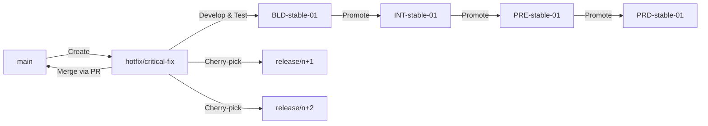
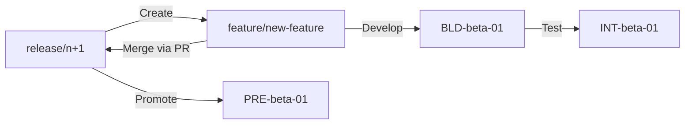

# Branching Strategy for Multi-Environment SDLC

## Overview

This document outlines the branching strategy for managing deployments across multiple environment layers (BLD, INT, PRE, PRD) with different release types (stable, beta, alpha) and multiple instances.

**Strategic Approach**: **Trunk-based development** is our primary strategic capability, enabling continuous iterative code delivery. All features are developed and deployed through the `main` branch using short-lived feature branches, feature flags, and gradual rollout.

**Architecture**: Each service has its own GitHub repository. All service repositories follow the same branching strategy independently, allowing for independent development and deployment cycles while maintaining consistency across the organization.

**See [TRUNK_BASED_STRATEGY.md](./TRUNK_BASED_STRATEGY.md)** for detailed trunk-based development strategy and implementation guide.

## Environment Model

### Environment Layers
- **BLD** (Build): Initial build and validation
- **INT** (Integration): Integration testing
- **PRE** (Pre-production): Pre-production validation
- **PRD** (Production): Production environment

### Release Types
- **stable**: Current production release (version n)
- **beta**: Next release candidate (version n+1)
- **alpha**: Future release candidate (version n+2)

### Environment Instances
- Multiple instances per release type (e.g., `stable-01`, `beta-01`, `beta-02`)
- Each instance represents a separate deployment target

## Branch Structure

### Primary Branches

#### 1. `main` Branch (Trunk) - PRIMARY STRATEGIC CAPABILITY

- **Purpose**: Single source of truth, production-ready code (version n)
- **Strategic Role**: Primary branch for all development - trunk-based development is our strategic capability
- **Deploys to**: `BLD-stable-01` → `INT-stable-01` → `PRE-stable-01` → `PRD-stable-01`
- **Protection**: Strict protection, requires PR reviews and CI/CD validation
- **Merge Policy**: 
  - ✅ **Feature branches** (PRIMARY: All features merge here iteratively)
  - ✅ Hotfixes (critical production fixes)
  - ✅ Release branch merges (OPTIONAL: Only for coordinated releases when needed)
- **Trunk-Based Development**: 
  - ✅ All features developed iteratively through `main`
  - ✅ Short-lived feature branches (hours to 1 day)
  - ✅ Feature flags enable gradual rollout
  - ✅ Continuous deployment on every merge
- **Always Deployable**: `main` must always be in a deployable state
- **Deployment Frequency**: Multiple times per day (continuous delivery)

#### 2. `release/n+1` Branch (Beta) - OPTIONAL

- **Purpose**: Optional branch for coordinated releases or extended beta testing
- **When to Use**: Only when you need:
  - Coordinated multi-service releases
  - Extended beta testing periods
  - Marketing/sales alignment for planned releases
- **Deploys to**: `BLD-beta-*` → `INT-beta-*` → `PRE-beta-*`
- **Protection**: Protected branch, requires PR reviews
- **Merge Policy**: Feature branches targeting beta release (rarely used)
- **Naming**: `release/v1.2.0`, `release/2024-Q2`, or semantic versioning
- **Note**: Most features should use trunk-based development instead

#### 3. `release/n+2` Branch (Alpha) - OPTIONAL

- **Purpose**: Optional branch for experimental features requiring extended testing
- **When to Use**: Only for experimental features that need isolation from production
- **Deploys to**: `BLD-alpha-*` → `INT-alpha-*`
- **Protection**: Protected branch, requires PR reviews
- **Merge Policy**: Feature branches targeting alpha release (rarely used)
- **Naming**: `release/v1.3.0`, `release/2024-Q3`, or semantic versioning
- **Note**: Most experimental features can use trunk-based with feature flags instead

### Supporting Branches

#### 4. `hotfix/*` Branches
- **Purpose**: Critical production fixes
- **Source**: Created from `main` branch
- **Flow**: `main` → `hotfix/CORENGC-xxxx-description` → `main` (via PR)
- **Deploys to**: `BLD-stable-01` → `INT-stable-01` → `PRE-stable-01` → `PRD-stable-01`
- **Naming**: `hotfix/CORENGC-1234-critical-bug-fix`, `hotfix/CORENGC-5678-security-patch`
  - Format: `hotfix/CORENGC-xxxx-description` (Jira ID required)

#### 5. `feature/*` Branches - PRIMARY DEVELOPMENT METHOD

- **Purpose**: New feature development (iterative, continuous delivery)
- **Source**: **PRIMARY**: Always created from `main` (trunk-based development)
- **Flow**: `main` → `feature/CORENGC-xxxx-feature-name` → `main` (via PR) → Production
- **Strategic Approach**: 
  - ✅ **All features** use trunk-based development
  - ✅ Features are broken down into small, iterative PRs
  - ✅ Each PR merges to `main` and deploys independently
  - ✅ Feature flags control gradual rollout
  - ✅ Large features are decomposed into multiple small PRs
- **Lifetime**: Hours to 1 day maximum (short-lived branches)
- **PR Size**: < 400 lines changed (ideally < 200 lines)
- **Naming**: `feature/CORENGC-1234-user-authentication`, `feature/CORENGC-5678-payment-integration`
  - Format: `feature/CORENGC-xxxx-description` (Jira ID required)
- **Decomposition Strategy**: 
  - Large features are broken into multiple small PRs
  - Each PR adds incremental value
  - Each PR is independently deployable
  - Feature flags hide incomplete features
- **Optional Release Track**: 
  - Only used for coordinated multi-service releases
  - Flow: `release/n+1` → `feature/CORENGC-xxxx` → `release/n+1` → Beta → Production
  - Rarely needed - trunk-based is preferred

#### 6. `develop/*` Branches (Optional)
- **Purpose**: Integration branch for multiple features before merging to release branch
- **Use Case**: When multiple features need to be integrated and tested together
- **Naming**: `develop/beta-integration`, `develop/alpha-integration`

## Branch-to-Environment Mapping

### Stable (Production) Flow
```
main branch
    ↓
BLD-stable-01 (Build & Validate)
    ↓
INT-stable-01 (Integration Testing)
    ↓
PRE-stable-01 (Pre-production Validation)
    ↓
PRD-stable-01 (Production)
```

### Beta (n+1) Flow
```
release/n+1 branch
    ↓
BLD-beta-01, BLD-beta-02, ... (Build & Validate)
    ↓
INT-beta-01, INT-beta-02, ... (Integration Testing)
    ↓
PRE-beta-01, PRE-beta-02, ... (Pre-production Validation)
```

### Alpha (n+2) Flow
```
release/n+2 branch
    ↓
BLD-alpha-01, BLD-alpha-02, ... (Build & Validate)
    ↓
INT-alpha-01, INT-alpha-02, ... (Integration Testing)
```

## Workflow Patterns

### 1. Hotfix Workflow (Production Fixes)



**Steps:**
1. Create `hotfix/critical-fix` branch from `main`
2. Develop and test fix
3. Deploy through stable environments (BLD → INT → PRE → PRD)
4. Merge `hotfix/critical-fix` back to `main` via PR
5. Cherry-pick fix to `release/n+1` and `release/n+2` if applicable

### 2. Feature Development Workflow (Beta Release)



**Steps:**
1. Create `feature/new-feature` branch from `release/n+1`
2. Develop feature
3. Deploy to beta environments for testing
4. Merge `feature/new-feature` to `release/n+1` via PR
5. Promote `release/n+1` through beta environments

### 3. Feature Development Workflow (Alpha Release)


**Steps:**
1. Create `feature/future-feature` branch from `release/n+2`
2. Develop feature
3. Deploy to alpha environments for early testing
4. Merge `feature/future-feature` to `release/n+2` via PR

### 4. Release Promotion Workflow

**Beta to Stable (n+1 → n):**
1. When `release/n+1` is ready for production:
   - Merge `release/n+1` to `main` via PR
   - Tag `main` with new version
   - Deploy `main` through stable environments
   - Create new `release/n+2` branch from `main` (old alpha becomes beta)

**Alpha to Beta (n+2 → n+1):**
1. When `release/n+2` is ready to become beta:
   - Merge `release/n+2` to `release/n+1` via PR
   - Create new `release/n+3` branch from `release/n+2` (if needed)

## Branch Protection Rules

### `main` Branch
- ✅ Require pull request reviews (minimum 1-2 approvals, depending on change size)
- ✅ Require status checks to pass (all CI/CD pipelines)
- ✅ Require branches to be up to date before merging
- ✅ Restrict pushes (no direct pushes)
- ✅ Require linear history (squash/rebase preferred, merge commits allowed for trunk-based)
- ✅ Fast CI/CD pipeline (< 10 minutes for trunk-based features)
- ✅ Auto-deploy to BLD on merge (trunk-based workflow)

### `release/*` Branches
- ✅ Require pull request reviews (minimum 1 approval)
- ✅ Require status checks to pass (relevant CI/CD pipelines)
- ✅ Allow force pushes (for release managers only)
- ✅ Restrict pushes (no direct pushes from developers)

### `hotfix/*` Branches
- ✅ Require pull request reviews (minimum 2 approvals)
- ✅ Require status checks to pass (all CI/CD pipelines)
- ✅ Fast-track option for critical security fixes

## CI/CD Pipeline Strategy

### Pipeline Triggers

1. **On Push to `main`:**
   - Trigger deployment to `BLD-stable-01`
   - Run full test suite
   - Run security scans

2. **On Push to `release/n+1`:**
   - Trigger deployment to `BLD-beta-*` instances
   - Run full test suite
   - Run integration tests

3. **On Push to `release/n+2`:**
   - Trigger deployment to `BLD-alpha-*` instances
   - Run full test suite

4. **On Push to `hotfix/*`:**
   - Trigger deployment to `BLD-stable-01`
   - Run critical path tests
   - Run security scans

5. **On Push to `feature/*`:**
   - Run unit tests
   - Run linting
   - Optionally deploy to feature-specific test environment
   - **If branch is from `main` (trunk-based)**: Prepare for fast merge to main
   - **If branch is from `release/*`**: Standard release workflow

6. **On Merge to `main` (Trunk-Based Features):**
   - Trigger automatic deployment to `BLD-stable-01`
   - Run full test suite (optimized for speed)
   - Run security scans
   - Auto-promote to `INT-stable-01` if tests pass
   - Manual approval for `PRE-stable-01` → `PRD-stable-01`

### Environment Promotion

Each environment layer should have promotion gates:
- **BLD → INT**: Automated tests pass, code review approved
- **INT → PRE**: Integration tests pass, QA sign-off
- **PRE → PRD**: Pre-production validation pass, change approval board sign-off

## Multi-Service Considerations

**Architecture**: Each service has its own GitHub repository. All 100+ service repositories follow the same branching strategy independently.

### Repository Structure

- **Each service = One GitHub repository**
- **Each repository follows the same branching strategy**:
  - `main` branch (production)
  - `release/n+1` branch (beta)
  - `release/n+2` branch (alpha)
  - `hotfix/*` branches (production fixes)
  - `feature/*` branches (new features)

### Service Independence

Each service repository operates independently:
- ✅ Services can have different release cycles
- ✅ Services can deploy independently to their environments
- ✅ Hotfixes are service-specific (only affect the service that needs fixing)
- ✅ Features are service-specific (developed within the service repository)

### Cross-Service Coordination

When multiple services need to coordinate:

#### 1. Coordinated Releases
For releases that span multiple services:
- **Release Planning**: Use a release coordination tool or service catalog
- **Version Alignment**: Align version tags across services (e.g., all services tag `v1.3.0` together)
- **Deployment Coordination**: Coordinate deployment windows for dependent services
- **Communication**: Use team channels/notifications for cross-service releases

#### 2. Cross-Service Features
When a feature requires changes in multiple services:
- Create feature branches in each affected service repository
- Use consistent naming: `feature/epic-name` across all repositories
- Coordinate PR reviews and merges
- Deploy services in dependency order

#### 3. Service Dependencies
When Service A depends on Service B:
- Service B deploys first to the target environment
- Service A waits for Service B deployment to complete
- Use dependency tracking in CI/CD pipelines
- Implement health checks and service discovery

#### 4. Release Coordination Tools
Consider using:
- **Service Catalog**: Track which services are part of which release
- **Release Management Platform**: Tools like Release Drafter, Semantic Release
- **Deployment Orchestration**: Tools like ArgoCD, Spinnaker for coordinated deployments
- **Communication Channels**: Slack/Teams channels for release coordination

### Example: Multi-Service Release

**Scenario**: Releasing a new payment feature that requires changes in:
- `payment-service` (new payment methods)
- `user-service` (user payment preferences)
- `api-gateway` (new endpoints)

**Process**:
1. Create `feature/CORENGC-5678-new-payment-method` branch in each repository (Jira ticket: CORENGC-5678)
2. Develop features independently in each service
3. Coordinate PR reviews (same reviewers across services)
4. Merge to `release/n+1` in each repository simultaneously
5. Deploy in order: `user-service` → `payment-service` → `api-gateway`
6. Verify integration in beta environments
7. When ready, merge `release/n+1` → `main` in all services
8. Deploy to production in the same order

## Version Tagging Strategy

### Tag Format
- **Stable**: `v1.2.3` (semantic versioning)
- **Beta**: `v1.3.0-beta.1`, `v1.3.0-beta.2`
- **Alpha**: `v1.4.0-alpha.1`, `v1.4.0-alpha.2`
- **Hotfix**: `v1.2.4-hotfix.1`

### Tagging Rules
- Tag `main` on every merge (production release)
- Tag `release/n+1` on significant milestones
- Tag `release/n+2` on significant milestones
- Tag `hotfix/*` branches before merging to `main`

## Best Practices

### 1. Branch Naming Conventions
- **Required Format**: Include Jira ticket ID (CORENGC-xxxx) in all feature and hotfix branches
- **Hotfix Format**: `hotfix/CORENGC-xxxx-description`
  - Example: `hotfix/CORENGC-1234-critical-auth-fix`
- **Feature Format**: `feature/CORENGC-xxxx-description`
  - Example: `feature/CORENGC-5678-user-authentication`
- Use kebab-case for descriptions
- Keep descriptions concise but descriptive

### 2. Commit Messages
- Follow conventional commits: `feat:`, `fix:`, `docs:`, `chore:`, `refactor:`
- Reference tickets: `fix: resolve authentication issue [JIRA-123]`
- Keep commits atomic and focused

### 3. Pull Request Guidelines
- Clear description of changes
- Link to related tickets/issues
- Include testing instructions
- Request appropriate reviewers
- Ensure CI/CD passes before requesting review

### 4. Merge Strategies
- **Squash and Merge**: Preferred for trunk-based feature branches (clean history, fast delivery)
- **Rebase and Merge**: For hotfix branches (linear history)
- **Merge Commit**: Allowed for trunk-based features when preserving branch context is useful
- **Fast Merge**: Trunk-based features should merge quickly (< 1 day from creation)

### 5. Branch Lifecycle
- Delete branches after merge (automated)
- Keep `hotfix/*` branches until fix is verified in production
- Archive old `release/*` branches after promotion

## Example Scenarios

### Scenario 1: Critical Production Bug
1. Bug discovered in `PRD-stable-01` (Jira ticket: CORENGC-1234)
2. Create `hotfix/CORENGC-1234-critical-bug-fix` from `main`
3. Fix bug and test in `BLD-stable-01`
4. Deploy through `INT-stable-01` → `PRE-stable-01` → `PRD-stable-01`
5. Merge `hotfix/CORENGC-1234-critical-bug-fix` to `main`
6. Cherry-pick to `release/n+1` and `release/n+2`

### Scenario 2a: Small Feature (Trunk-Based - Fast Track)
1. Create `feature/CORENGC-5678-ui-improvement` from `main` (Jira ticket: CORENGC-5678)
2. Develop small feature (hours to 1 day)
3. Create PR: `feature/CORENGC-5678-ui-improvement` → `main`
4. Review and merge to `main`
5. Automatic deployment to `BLD-stable-01` → `INT-stable-01`
6. Promote to `PRE-stable-01` → `PRD-stable-01` when ready
7. **Result**: Feature in production same day or next day

### Scenario 2b: Large Feature (Release Track)
1. Create `feature/CORENGC-5678-new-payment-method` from `release/n+1` (Jira ticket: CORENGC-5678)
2. Develop feature over days/weeks
3. Deploy to `BLD-beta-01` for testing
4. Test in `INT-beta-01`
5. Merge `feature/CORENGC-5678-new-payment-method` to `release/n+1`
6. Promote `release/n+1` through beta environments
7. Eventually merge `release/n+1` → `main` for production
8. **Result**: Feature in production after 2-4 weeks of testing

### Scenario 3: Experimental Feature
1. Create `feature/CORENGC-9012-experimental-ai` from `release/n+2` (Jira ticket: CORENGC-9012)
2. Develop feature
3. Deploy to `BLD-alpha-01` for early testing
4. Test in `INT-alpha-01`
5. Merge `feature/CORENGC-9012-experimental-ai` to `release/n+2`
6. Eventually promote to beta when ready

### Scenario 4: Release Promotion
1. `release/n+1` is stable and ready for production
2. Create PR: `release/n+1` → `main`
3. Review and approve
4. Merge to `main`
5. Tag `main` with new version (e.g., `v1.3.0`)
6. Deploy `main` through stable environments
7. Create new `release/n+2` branch from `main` (old alpha becomes new beta)

## Tools and Automation

### Recommended Tools
- **Git**: Version control
- **GitHub/GitLab/Bitbucket**: Code hosting and PR management
- **CI/CD**: Jenkins, GitLab CI, GitHub Actions, CircleCI
- **Release Management**: Semantic Release, Release Drafter
- **Branch Protection**: Native Git hosting platform features
- **Deployment Automation**: ArgoCD, Flux, Spinnaker

### Automation Opportunities
1. Auto-create release branches on version bump
2. Auto-promote environments on successful tests
3. Auto-tag releases on merge to `main`
4. Auto-cherry-pick hotfixes to release branches
5. Auto-delete merged branches
6. Auto-generate release notes

## Migration Strategy

If migrating from existing strategy:

1. **Phase 1**: Establish `main` as production branch
2. **Phase 2**: Create `release/n+1` branch from current development
3. **Phase 3**: Create `release/n+2` branch for future features
4. **Phase 4**: Update CI/CD pipelines to map branches to environments
5. **Phase 5**: Train team on new branching strategy
6. **Phase 6**: Gradually migrate services to new strategy

## Monitoring and Metrics

Track:
- Time to production (from commit to PRD)
- Hotfix frequency
- Feature delivery time
- Branch lifetime
- Merge conflict frequency
- Deployment success rate

## Release Orchestration Integration

This branching strategy integrates seamlessly with release orchestration tools like **Harness**, **Spinnaker**, or **ArgoCD**:

### Key Integration Points

1. **Branch-to-Environment Mapping**: Clear mapping enables automated environment selection
   - `main` → `BLD-stable-01` → `INT-stable-01` → `PRE-stable-01` → `PRD-stable-01`
   - `release/n+1` → `BLD-beta-01` → `INT-beta-01` → `PRE-beta-01`
   - `release/n+2` → `BLD-alpha-01` → `INT-alpha-01`

2. **Dynamic Environment Creation**: New environments can be created based on branch patterns
   - Pattern-based naming: `{LAYER}-{RELEASE_TYPE}-{INSTANCE}`
   - Automatic creation when new release branches are created

3. **Coordinated Multi-Service Releases**: Dependency-based deployment orchestration
   - Services deploy in correct dependency order
   - Automated promotion gates with manual approvals

4. **Automated Promotion**: CI/CD pipelines automatically promote through environments
   - BLD → INT: Automated (tests pass)
   - INT → PRE: Manual approval (QA)
   - PRE → PRD: Manual approval (Release manager)

See **[RELEASE_ORCHESTRATION.md](./RELEASE_ORCHESTRATION.md)** for detailed integration guide with Harness and other orchestration tools.

## Conclusion

This branching strategy provides:
- ✅ Clear separation between production, beta, and alpha releases
- ✅ Intuitive hotfix workflow for production issues
- ✅ Scalable approach for 100s of services (each with its own repository)
- ✅ Environment promotion path from BLD → INT → PRE → PRD
- ✅ Support for multiple instances per environment type
- ✅ Alignment with `main` branch as production source of truth
- ✅ Service independence: each service repository operates independently
- ✅ Cross-service coordination strategies for coordinated releases
- ✅ Trunk-based development for faster delivery
- ✅ Release orchestration integration for automated deployments

The strategy balances flexibility for development with stability for production, ensuring that `main` always reflects what's deployed to production while allowing parallel development of future releases. Each service repository follows the same strategy, enabling consistency across the organization while maintaining service autonomy. Integration with release orchestration tools automates deployments and environment management, reducing manual effort and errors.

